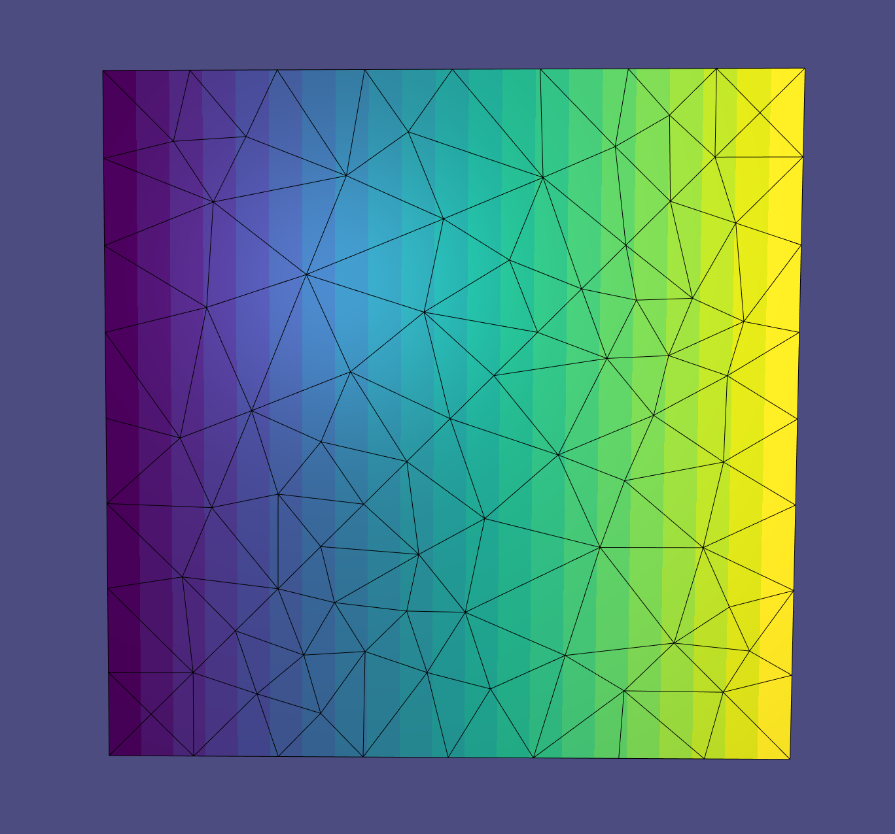
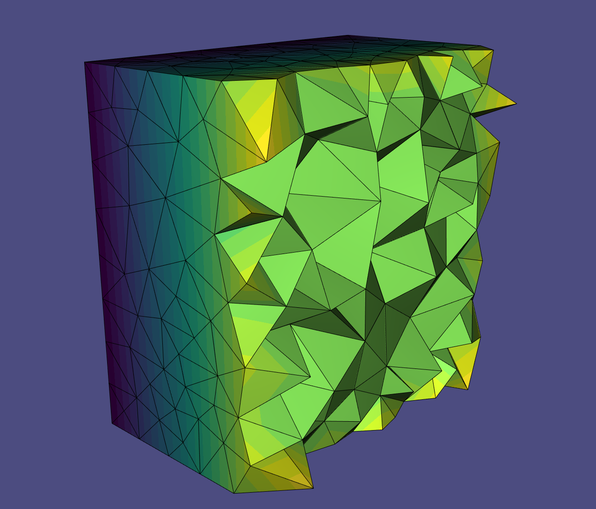

# dual laplace

An implementation of the tetrahedral laplacian operators described in the SGP 2020 paper [Properties of Laplace Operators for Tetrahedral Meshes](https://igl.ethz.ch/projects/LB3D/LB3D.pdf). 

In addition to implementing the dual laplacian in ```src/dual_laplacian.h```, I also provide code written in libigl-style for:
1. ```src/circumcentre3d.h```: calculates the circumcentre of triangles and tetrahedrons in 3D space  
2. ```src/tet_volume.h```: calculates the volume of a tetrahedron

Author: esther, 2020

Project link: [https://github.com/estherlin/dual-laplace](https://github.com/estherlin/dual-laplace)

Project demo video: 

## Structure of Repo

-   ```include/```: contains header files with documentation
-   ```src/```: contains ```.cpp``` files
-   ```data/```: contains ```.off``` files used in demo and development
-   ```assets/```: contains screenshots and ```.gif``` files demo-ing the program

## Setup

-   Template from [libigl-example-project](https://github.com/libigl/libigl-example-project)
-   Demo adapted from [Example 605 Tetgen](https://github.com/libigl/libigl/blob/master/tutorial/605_Tetgen/main.cpp) and [Example 303 Laplace Equation](https://github.com/libigl/libigl/blob/master/tutorial/303_LaplaceEquation/main.cpp)

### Dependencies

-   [libigl](http://libigl.github.io/libigl/): make sure to have the full install! Have a version of libigl that is built according to the [libigl tutorial](https://libigl.github.io/tutorial/#downloading-libigl)
-   Eigen
-   Tetgen: comes with the full install of libigl

### Compile

Compile this project using the standard cmake routine:

    mkdir build
    cd build
    cmake ..
    make

This should create a `tetra` binary.

### Run

From within the `build` directory, issue:

    ./tetra
A glfw app should launch displaying a 3D cube. 

-   To see cross sections of the cube, enter numbers between 1 and 9
-   To see the entire cube, enter 'B' or 'b'

To see other meshes, issue:

```
./tetra ../data/<file>.off
```

Beware! Other meshes may take a **long** time to load!

## Demo

### Libigl-style Tutorial

While the cotan Laplacian operator has been well studied and implemented for triangle meshes, there is no similar default option for tetrahedral meshes. This is because for triangle meshes, two different approaches from the finite element and finite volume methods both yield the cotan Laplacian. However, for tetrahedral meshes, the finite element method yields the primal Laplacian while the finite volume method yields the dual Laplacian. These two Laplacians are often different and can have different applications. The focus of this project is to construct the dual Laplacian operator for a tetrahedral mesh. 

Starting with a finite volume approach, we consider the action of a Laplacian to be a sparse matrix of weights $w_{ij}$ in:
$$
(\mathbf{L f})_{i}=\sum_{(i, j) \in \mathcal{M}} w_{i j}\left(f_{j}-f_{i}\right) \text{, }\quad w_{i j}=w_{j i}
$$
where $\mathcal{M}$ is our mesh. Applying Stokes theorem to the integrated Laplcian leads to an expression for $w_ij$:
$$
w_{i j}=\frac{\operatorname{Vol}(\star(i, j))}{\operatorname{Vol}(i, j)}
$$
where $\operatorname{Vol}(\cdot)$ is the measure of an element. For example, $\operatorname{Vol}(i,j)$ would be the length of the edge between vertices $i$ and $j$, $\operatorname{Vol}(i,j,k) $ would be area, and $\operatorname{Vol}(i,j,k,l)$ would be volume. Also, $(\star(i,j))$ is the polygon dual to edge $(i, j)$. The vertices of this polygon will be at the circumcentre of the tetrahedron, the two triangles adjacent to edge $(i,j)$, and the midpoint of edge $(i,j)$. Then, we slice the polygon into two triangles. From here, the area can be found by determing the signed volume of the tetrahedron formed by each of these triangles with vertex $i$ and dividing it by $\operatorname{Vol}(i,j)$, the height of this tetrahedron. 

We take the approach of summing togetther the contributions for each triangle, for each tetrahedron in the mesh to construct the dual Laplacian $\mathbf{L}$, similar to how the cotan Laplacian is constructed in libigl. This expression indicates that even for a tetrahedral mesh, the edge weights can be considered on a per triangle basis. The benefit of this approach is that we can construct the diagonal mass matrix simultaneously. The pseudocode used to construct the dual Laplacian $\mathbf{L}$ and the mass matrix $\textbf{M}$ is as follows:

```c++
for (int i: tetrahedrons){
    calculate circumcentre of tet: tet_cc
    for (int j: 4 vertices){
        for (int k: 3 vertices, k != j){
            calculate circumcentre of triangle construct: tri_cc
            calculate midpoint of edge (j,k): edge_cc
            calculate volume of tetrahedron (j, tet_cc, tri_cc, edge_cc)
            calculate weight
              
            L(i,j) += weight;
            L(j,i) += weight;
            L(i,i) -= weight;
            L(j,j) -= weight;
            M(i,i) += volume;
            M(j,j) += volume;
        }
    }
}
```

This code is implemented in ```src/dual_laplacian.h``` and can be called with

```c++
dual_laplacian(TV, TT, L, M);
```

where ```TV``` is our matrix of vertex coordinates and ```TT``` is matrix of tetrahedrons. 

<p float="left">
  
   
</p>


### Demo


In this example, we solve the Laplace equation
$$
\Delta u = 0
$$
where $\Delta$ is the Laplacian operator and $u$ are the values at the vertices of our 3D mesh, subject to Dirichlet boundary conditions
$$
u\vert_{\partial S} = 0
$$


