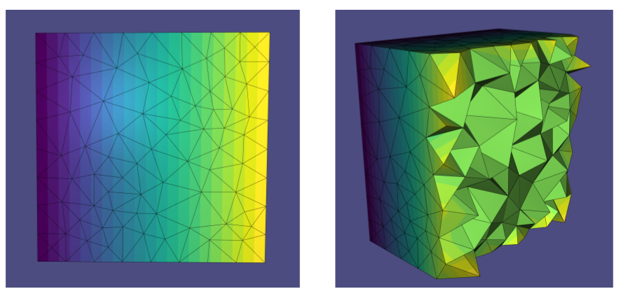

## Links to Full Project

Please refer to:

-   ```entry.md``` below for the libigl tutorial-style explanation of this project
-   [YouTube](https://youtu.be/0IMYSC3cPkQ) for a 1 min demo of this project
-   [GitHub (this project)](https://github.com/estherlin/dual-laplace) for everything else


# Libigl-style Tutorial

While the cotan Laplacian operator has been well studied and implemented for triangle meshes, there is no similar default option for tetrahedral meshes. This is because for triangle meshes, two different approaches from the finite element and finite volume methods both yield the cotan Laplacian. However, for tetrahedral meshes, the finite element method yields the primal Laplacian while the finite volume method yields the dual Laplacian. These two Laplacians are often different and can have different applications. The focus of this project is to construct the dual Laplacian operator for a tetrahedral mesh. 

Starting with a finite volume approach, we consider the action of a Laplacian to be a sparse matrix of weights $w_{ij}$ in:
$$
(\mathbf{L f})_{i}=\sum_{(i, j) \in \mathcal{M}} w_{i j}\left(f_{j}-f_{i}\right) \text{, }\quad w_{i j}=w_{j i}
$$
where $\mathcal{M}$ is our mesh. Applying Stokes theorem to the integrated Laplacian leads to an expression for $w_ij$:
$$
w_{i j}=\frac{\operatorname{Vol}(\star(i, j))}{\operatorname{Vol}(i, j)}
$$
where $\operatorname{Vol}(\cdot)$ is the measure of an element. For example, $\operatorname{Vol}(i,j)$ would be the length of the edge between vertices $i$ and $j$, $\operatorname{Vol}(i,j,k) $ would be area of a triangle, and $\operatorname{Vol}(i,j,k,l)$ would be volume of a tetrahedron. Also, $(\star(i,j))$ is the polygon dual to edge $(i, j)$. The vertices of this polygon will be at (1) the circumcentre of the tetrahedron: $\textbf{c}_{ijkl}$, (2-3) the circumcentre of the two triangles adjacent to edge $ (i,j)$: $\textbf{c}_{ijk}, \textbf{c}_{ijl}$, and (4) the midpoint of edge $(i,j)$: $\textbf{c}_{ij}$. Next, we slice the polygon into two triangles. From here, the area of the polygon can be found by determining the signed volume of the tetrahedron formed by each of these triangles with vertex $i$ and dividing it by $\frac{1}{2}\operatorname{Vol}(i,j)$, the height of this tetrahedron. Finally, we get an expression for $w_{ij}$ in terms of vertices:
$$
w_{i j}=\sum_{(i, j, k, l)} w_{i j k l}+w_{i j l k}
$$
where
$$
w_{i j k l}=6 \frac{\operatorname{Vol}\left(j,\mathbf{c}_{i j}, \mathbf{c}_{i j k}, \mathbf{c}_{i j k l}\right)}{\operatorname{Vol}(i, j)^{2}}\text{ , }\quad w_{i j lk}=6 \frac{\operatorname{Vol}\left(j,\mathbf{c}_{i j}, \mathbf{c}_{i j kl}, \mathbf{c}_{i j  l}\right)}{\operatorname{Vol}(i, j)^{2}}
$$
This expression for the weights indicates that even for a tetrahedral mesh, the edge weights can be considered on a per triangle basis. We take the approach of summing together the contributions for each triangle, for each tetrahedron in the mesh to construct the dual Laplacian $\mathbf{L}$, similar to how the cotan Laplacian is constructed in my smoothing assignment. The benefit of this approach is that we can construct the diagonal mass matrix simultaneously, where the entries are the volume contributions $\operatorname{Vol}\left(j, \mathbf{c}_{i j}, \mathbf{c}_{i j k}, \mathbf{c}_{i j k l}\right)$.

The pseudocode used to construct the dual Laplacian $\mathbf{L}$ and the mass matrix $\textbf{M}$ is as follows:

```c++
for (int i: tetrahedrons){
    calculate circumcentre of tet: tet_cc
    for (int j: 4 vertices){
        for (int k: 3 vertices, k != j){
            calculate circumcentre of triangle construct: tri_cc
            calculate midpoint of edge (j,k): edge_cc
            calculate volume of tetrahedron (j, tet_cc, tri_cc, edge_cc): vol
            calculate weight: w
              
            L(j,k) += w;
            L(k,j) += w;
            L(j,j) -= w;
            L(k,k) -= w;
            M(j,j) += vol;
            M(k,k) += vol;
        }
    }
}
```

This code is implemented in ```src/dual_laplacian.h``` and can be called with

```c++
dual_laplacian(TV, TT, L, M);
```

where ```TV``` is our matrix of vertex coordinates and ```TT``` is matrix of tetrahedrons, and L and M are sparse matrix representations of the operators. 



​	*Solving of a Dirichlet boundary value problem with the dual laplacian*


​	*Solving of a Dirichlet boundary value problem with the dual laplacian animation*

--This ends the libigl style tutorial. --
